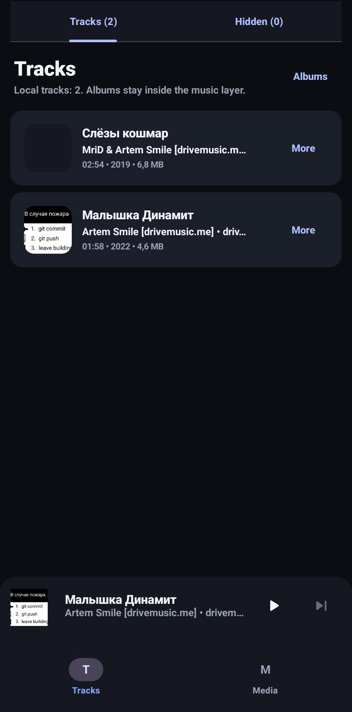
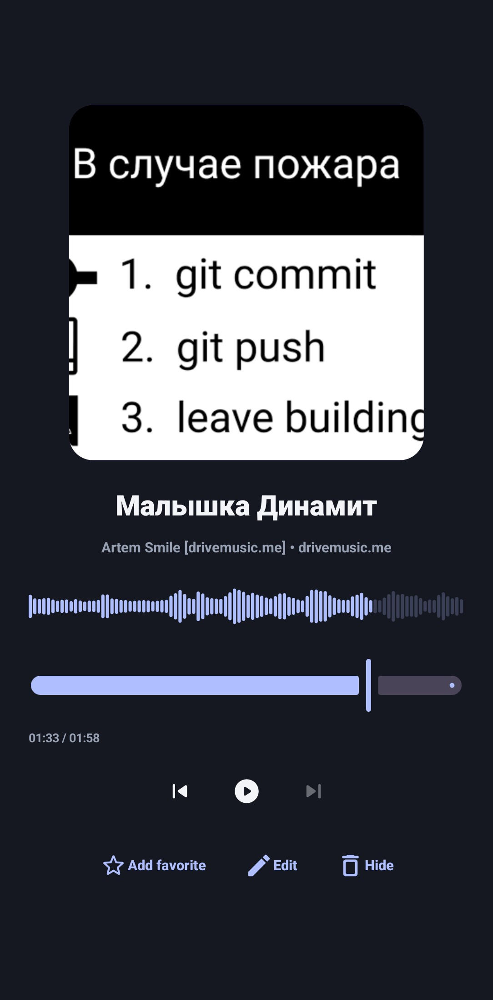
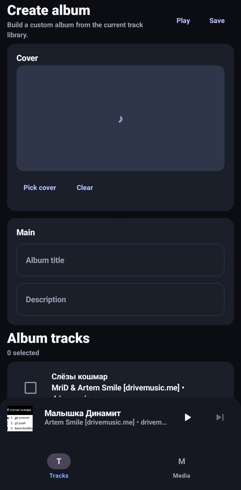

# Resono
Resono is an offline-first Android media app focused on local content. The current build provides a local audio workflow (track list, album management, playback) and a scaffolded gallery entry point. The codebase follows a clean, multi-module setup with domain contracts at the center and separate data/player implementations.

## Features
- Local audio library from `MediaStore` (scan + list).
- Audio playback with mini/expanded player sheet:
  - play/pause, next/previous, seek,
  - waveform visualization,
  - favorite toggle,
  - metadata edit (title/artist/album/artwork/track/year),
  - hide current track.
- Hidden tracks flow: hide/restore tracks without deleting files.
- User albums: create, edit, delete, assign tracks, play album.
- Gallery tab is present in navigation, but current UI is a placeholder screen (`Feature: Media Library`).

## Tech stack
- Kotlin + Coroutines + Flow.
- Jetpack Compose + Navigation Compose.
- Koin for DI.
- Media3 / ExoPlayer for playback.
- Room for local persistence (`resono.db`, schema migrations 1->2->3).
- Ktor dependencies are configured in `:data:network` (no active network implementation yet).
- Build setup: AGP 9.1, Gradle 9.3.1 wrapper, Java/Kotlin target 21, `minSdk 26`, `targetSdk 35`, `compileSdk 36`.

## Architecture overview
Dependency direction (high level):

```text
:app
  -> :feature:* (UI screens/navigation)
  -> :domain (contracts/models/use-cases)

:data:* -> :domain
:player:core -> :domain

:domain
  - pure Kotlin contracts/use-cases/models
  - no android.*, Compose, Media3, DI frameworks
```

State boundaries:
- Playback state: comes from `PlayerRepository.playerState` (domain contract, implemented in `:player:core`).
- UI state: owned by feature/app presentation state holders (`TrackListUiState`, `Album*UiState`, `AppPlayerUiState`).

DI entry points:
- App bootstrap: `app/src/main/kotlin/com/dev/resono/MainApplication.kt` (`startKoin`).
- Main modules wired there: `loggerModule`, `playerModule`, `localDataModule`, `repositoryModule`, `trackListModule`, `albumListModule`, `appModule`.

## Module structure
```text
:app
:domain

:data
:data:local
:data:database
:data:network
:data:repository

:player:core

:feature:player:track-list
:feature:player:album-list
:feature:player:player
:feature:gallery:media-library

:core:navigation
:core:logger
:core:ui
:core:ui:model
:core:ui:theme
:core:ui:component
```

Notes on roles:
- `:feature:player:track-list`: tracks tab, hidden tracks tab, metadata/favorite/hide actions.
- `:feature:player:album-list`: albums list + album editor.
- `:feature:player:player`: mini/expanded player sheet UI.
- `:feature:gallery:media-library`: gallery nav graph + placeholder screen.
- `:data:repository`: `MediaRepository` implementation and media/albums use-case bindings.
- `:data:local`: MediaStore data sources for audio/photo/video.
- `:data:database`: Room DAOs/entities for audio overrides + custom albums.
- `:player:core`: `PlayerRepository` + Media3 session service + waveform tap.
- `:core:ui:*`: shared UI model/theme/components.

## Project setup
1. Install Android Studio (recent stable) with Android SDK 36.
2. Use JDK 21.
3. From project root, build debug APK:
   - `./gradlew :app:assembleDebug`
4. Run app from Android Studio (`app` configuration) or install the APK from `app/build/outputs/apk/debug/`.
5. On first launch, grant media permissions (audio/images/video or external storage on API <= 32).

Build variants:
- `debug`: default local development build.
- `release`: minification enabled in `:app` (`isMinifyEnabled = true`).

## Screenshots
### Home


### Player (Expanded)


### Albums


## Roadmap
- Implement real gallery/photo/video UI on top of existing media domain/data contracts.
- Introduce network-backed sync path using existing remote-aware domain models (`MediaSource.RemoteOnly` / `MediaSource.Synced`) and `:data:network` module scaffold.
